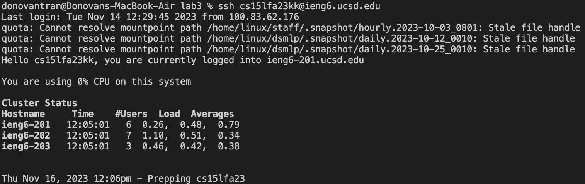
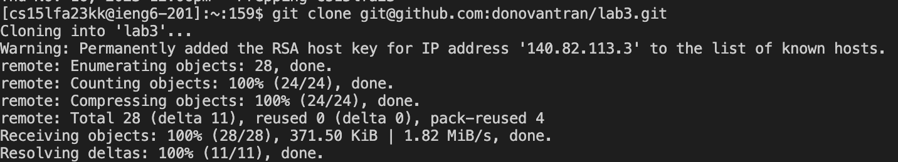
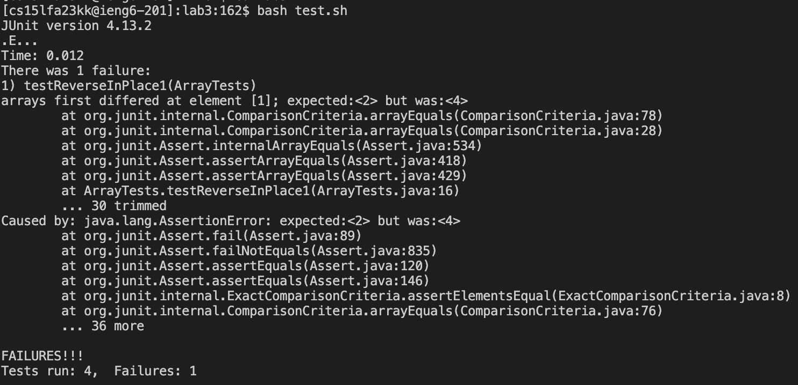
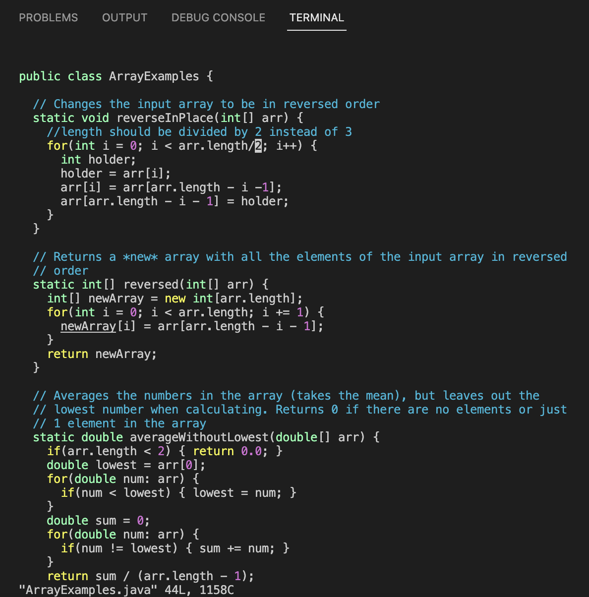

# Lab Report 4
---
For lab report 4, I recreated the steps within Lab 7 using the ArrayExamples from the previous lab. The error in the code is displayed here:

```


public class ArrayExamples {

  // Changes the input array to be in reversed order
  static void reverseInPlace(int[] arr) {
    for(int i = 0; i < arr.length/3; i++) {
      int holder;
      holder = arr[i];
      arr[i] = arr[arr.length - i -1];
      arr[arr.length - i - 1] = holder;
    }
  }

  // Returns a *new* array with all the elements of the input array in reversed
  // order
  static int[] reversed(int[] arr) {
    int[] newArray = new int[arr.length];
    for(int i = 0; i < arr.length; i += 1) {
      newArray[i] = arr[arr.length - i - 1];
    }
    return newArray;
  }

  // Averages the numbers in the array (takes the mean), but leaves out the
  // lowest number when calculating. Returns 0 if there are no elements or just
  // 1 element in the array
  static double averageWithoutLowest(double[] arr) {
    if(arr.length < 2) { return 0.0; }
    double lowest = arr[0];
    for(double num: arr) {
      if(num < lowest) { lowest = num; }
    }
    double sum = 0;
    for(double num: arr) {
      if(num != lowest) { sum += num; }
    }
    return sum / (arr.length - 1);
  }


}

```
The error in the code lies within line 8, where the lenght of the `arr` should be divided by 2 instead of 3 in order the reverse the contents of the int array.
The following screen shots are the steps taken to recreate the steps we did during lab, but on ArrayExamples.

Step 4:

Keypressed:<up>
Explanation: Within my local terminal, I only used the `ssh cs15lfa23kk@ieng6.ucsd.edu` command. This allows me to only press the up arrow once and enter to get to login into my ieng6 account.

---
Step 5:

Keypressed:<up><up><up><up><up><up><up><up><up><up><up><enter>
Explnation: Now that I am remotely within ieng6, I used the command `git clone git@github.com:donovantran/lab3.git` to clone the repository into the ieng6 directories. I used the ssh url into order to clone the repository. Because of some mistakes and testing, I had to press <up> 11 times and enter in order to get to the command.

---
Step 6:

Keypressed: <up><up><up><up><up><up><up><up><up><up><enter>
            <up><up><up><up><up><up><up><up><enter>
Explanation: The picture above shows the code failing to pass the test that are within the directory lab3. Before I am able to run the `test.sh` bash script, I first had to the `cd` into the lab3 directory, which was 10 up arrows and then pressing enter. Similarily, I had to press the up arrow 9 times to run the bash script. The commands that were ran were `cd lab3` and `bash test.sh` respectively.

---
Step 7:

Keypressed: <up><up><up><up><up><up><up><up><enter>
Keypressed (editing): :8<enter>14er2:wq
Explanation: In order to edit the code on a remote server, we are going to use vim editor to edit `ArrayExamples.java` where the error in the cdoe is. I pressed the up arrow 8 times and enter and enter in order to use the command `vim ArrayExamples.java`. In order to change 3 to 2, my keypresses were `:8<enter>14ere:wq`. `:8` got me to line 8, `14e` moved me to the end of the 14th word in the line, `r2` replaced the text the cursor was on to 2, and `:wq` saved and quit the vim instance.  

---
Step 8: 
image
Keypressed: <up><up><up><up><up><up><up><enter>
Explanation: 7 up arrows and enter allowed me to run `bash test.sh`, which passed all four tests.

---
Step 9:
Keypressed:<up><up><up><up><up><up><enter>
Keypressed:<up><up><up><<enter>
Keypressed:<up><enter>
Explanation: In order to get the file ready to commit, I used the command `git add ArrayExamples.java` which I acessed with 6 up arrows and enter. Next, in order to commit, I pressed the up arrow 3 times and enter to use the command `git commit -m "the value length is divided by was updated"`. This command commits the changes, and with the `-m` option, it allowed me to add the commit message within the same line. Finally, I pushed my commit to the main branch of my GitHub Respository lab3 with `git push origin main` which was used with 1 up arrow and enter.


This is how I recreated the steps in Lab 7 with the ArrayExamples.java file and Lab 3 material.
